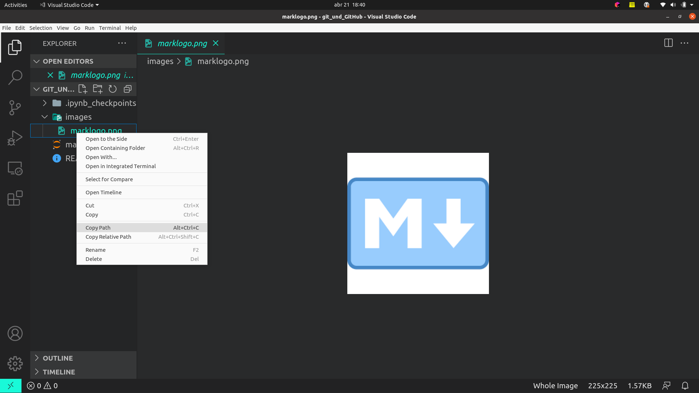

# Markdown

### HEADINGS

#### Add number (#) in front of a word or phrase. The number of number signs you use should correspond to the heading level.

# Heading level 1
## Heading level 2
### Heading level 3
#### Heading level 4
##### Heading level 5
###### Heading level 6

---
### BOLD

Two ways, but **bold** is better than __bold__

---
### ITALIC

Two ways, but *italic* is better than _italic_

---

### BOLD AND ITALIC
***Best Practices***

---

### BLOCKQUOTES

> To create a blockquote, add a ">" in front of a paragraph.
>
> Blockquotes can contain multiple paragraphs. Add a ">" on the blank lines between the paragraphs.
>
>> Add a ">>" in front of the paragraph if you want to nest.

---

### LISTS

- First item
- Second item

1. First item
2. Second item

* This is the first list item.

    I need to add another paragraph.
    - Here's the second list item.
        - or...

---
### CHECK LIST

- [x] ok
- [ ] To do

---
### Escaping Backticks

``If the word or phrase you want to denote as code includes one or more backticks, you can escape it by enclosing the `word` or phrase in double backticks``

---
### LINKS

To create a link, enclose the **link text in brackets** (e.g., [Link_text]) and then follow it immediately with the **URL in parentheses** (e.g., (urlDelLink))

Access my profile GitHub in [My GitHub](https://github.com/amorim-dev).

---
### IMAGES

Add an exclamation mark (!), followed by alt text in brackets, and the **URL** or **path**  to the image asset in parentheses. You can optionally add a title in quotation marks after the path or URL.

